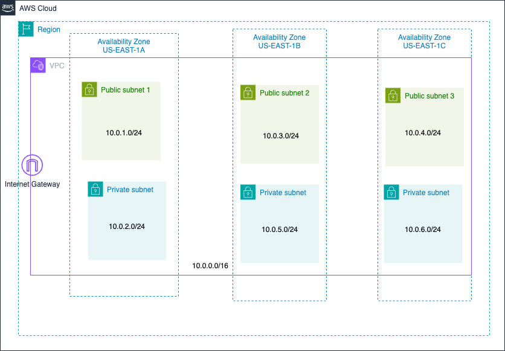

# Virtual Private Cloud (VPC)

| Resource Type           | Name                        | Description                                        |
| ----------------------- | --------------------------- | -------------------------------------------------- |
| AWS Provider            | -                           | Provider for AWS                                   |
| VPC                     | my_vpc                      | Virtual Private Cloud                              |
| Subnet                  | public_subnet_1             | Public Subnet 1 in us-east-1a                      |
| Subnet                  | public_subnet_2             | Public Subnet 2 in us-east-1b                      |
| Internet Gateway        | igw                         | Internet Gateway for the VPC                       |
| Route Table             | public_route_table          | Route table for public subnets                     |
| Route Table Association | public_subnet_association_1 | Associates public_subnet_1 with public_route_table |
| Route Table Association | public_subnet_association_2 | Associates public_subnet_2 with public_route_table |

### VPC Details

- **Name:** my_vpc
- **CIDR Block:** 10.0.0.0/16
- **DNS Support:** Enabled
- **DNS Hostnames:** Enabled
- **Tags:** Name: my_vpc, Environment: dev

### Subnets Details

| Subnet Name     | Availability Zone | CIDR Block  | Map Public IP On Launch | Tags                                    |
| --------------- | ----------------- | ----------- | ----------------------- | --------------------------------------- |
| public_subnet_1 | us-east-1a        | 10.0.1.0/24 | true                    | Name: Public Subnet 1, Environment: dev |
| public_subnet_2 | us-east-1b        | 10.0.2.0/24 | true                    | Name: Public Subnet 2, Environment: dev |

### Internet Gateway Details

- **Name:** my_igw
- **Tags:** Name: my_igw, Environment: dev

### Route Table Details

- **Name:** public_route_table
- **Associated Subnets:** public_subnet_1, public_subnet_2
- **Routes:**
  - Destination: 0.0.0.0/0, Target: igw (Internet Gateway)
- **Tags:** Name: public_route_table, Environment: dev
